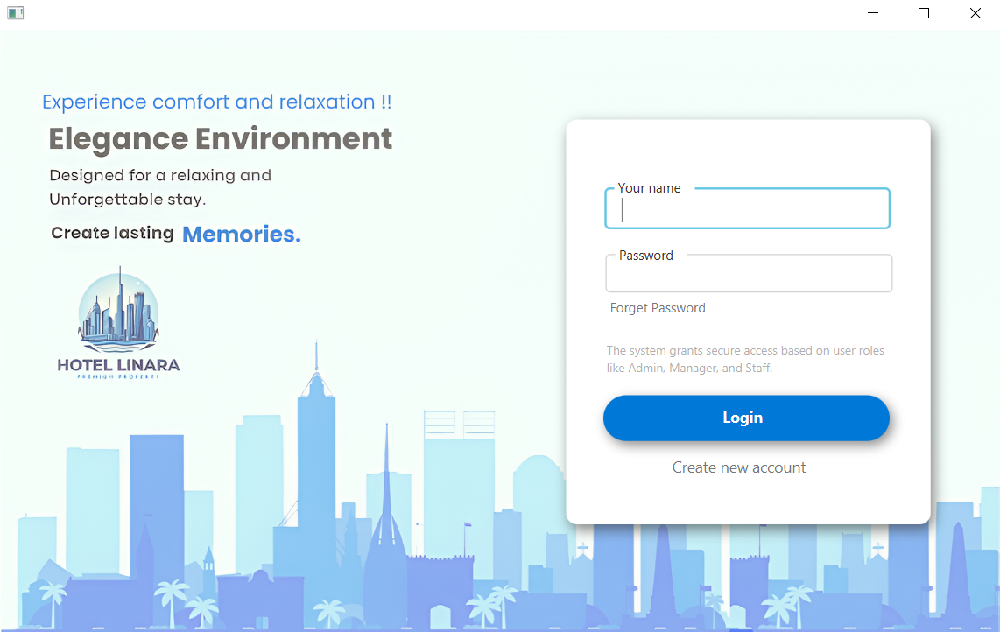
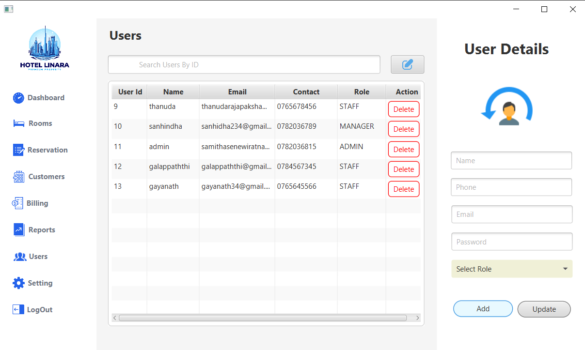
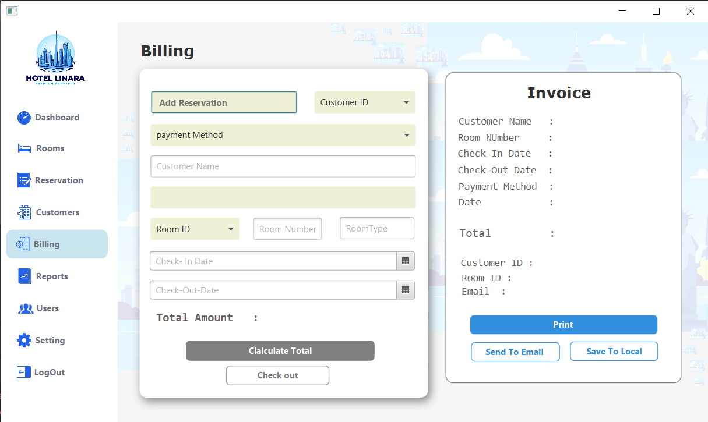
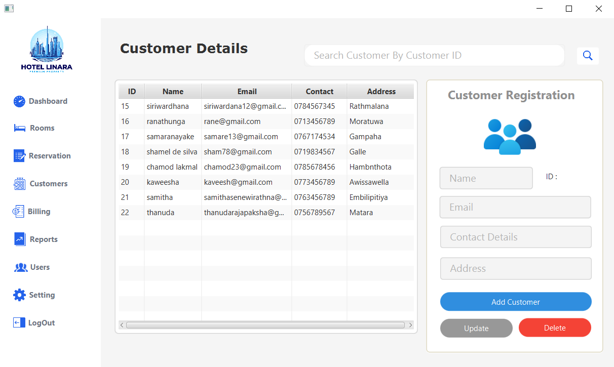
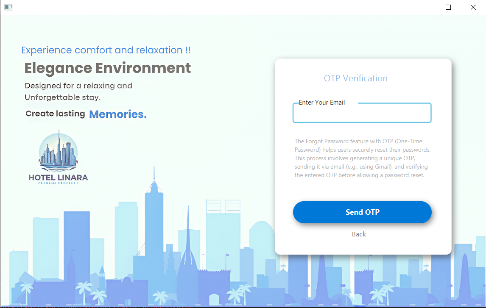

# 🏨 Hotel Linara JavaFX Application

## 📌 Overview
**Hotel Linara** is a comprehensive JavaFX-based hotel reservation system designed to streamline hotel operations and enhance guest management.  
It offers a clean, layered architecture for managing rooms, customers, reservations, billing, and user access with robust security and reporting features.

---

## 🚀 Features

### 🔐 User Authentication & Security
- Secure login with encrypted credentials
- Role-based access control (Admin, Manager, Staff)

### 🛏️ Room Management
- Add, update, delete, and view hotel rooms
- Manage room status (Available, Reserved, Occupied)

### 📅 Reservation Management
- Create and manage customer reservations
- Check room availability and reservation history

### 🧳 Check-in / Check-out
- Seamless guest check-in and check-out with real-time updates
- Automatically calculate charges based on stay duration and services

### 🧾 Billing & Invoicing
- Automated billing with tax, discounts, and PDF invoice generation
- Email confirmations with optional OTP verification

### 👤 Customer Management
- Maintain detailed guest profiles and past stays

### 📊 Reporting & Analytics
- Generate detailed reports: occupancy, revenue, and user activity

---

## 🛠️ Technologies Used

- **Programming Language**: Java  
- **UI Framework**: JavaFX  
- **Database**: MySQL  
- **Connectivity**: JDBC 
- **Build Tool**: Maven  
- **Security**: Jasypt encryption, JavaMail/SunMail for OTP  
- **Animations**: AnimateFX  
- **Architecture**: Layered (Entity, DAO, Service, Controller)

---

## 🖼️ Screenshots

### 🔐 Login Screen

### 📊 Dashboard

### 🛏️ Room Management

### 📅 Reservation Management

### 📈 Reports Dashboard

### 👥 User Management

### 🧾 Billing & Invoicing

### 👤 Customer Management

### 🔑 Forgot Password

---

